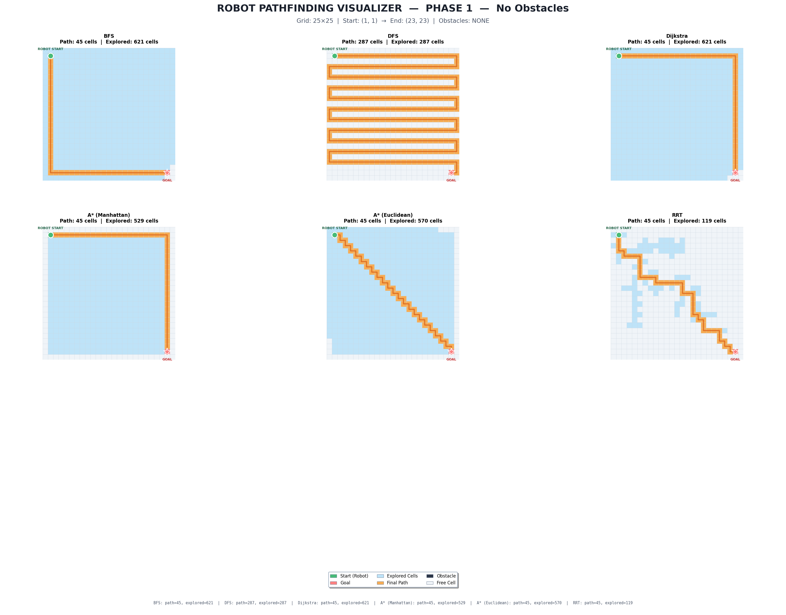
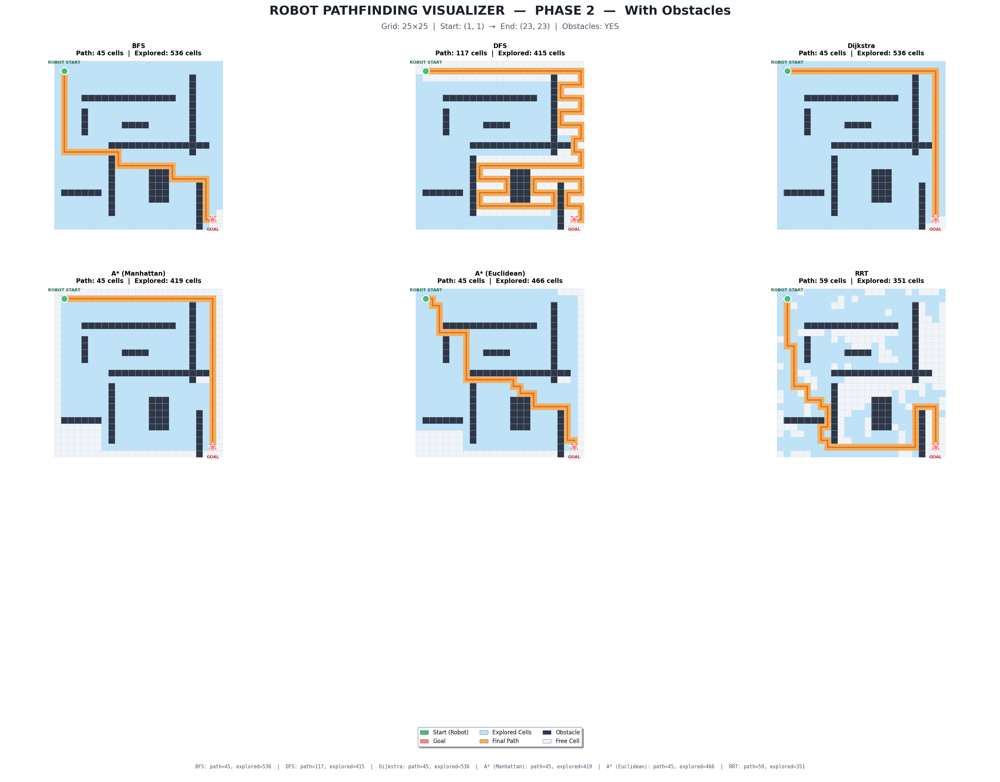
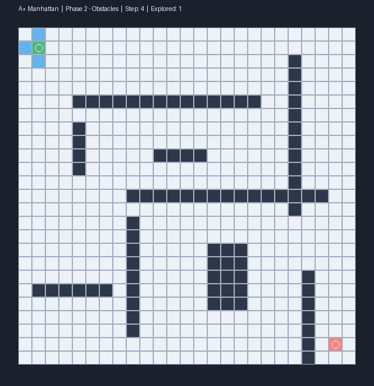
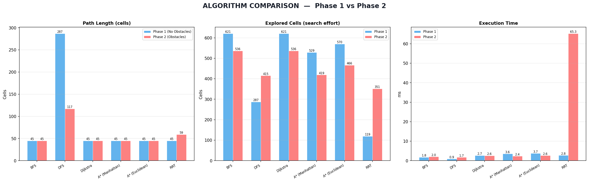
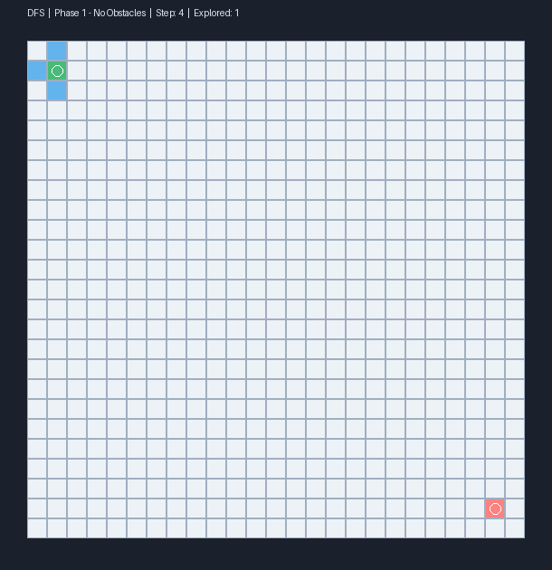
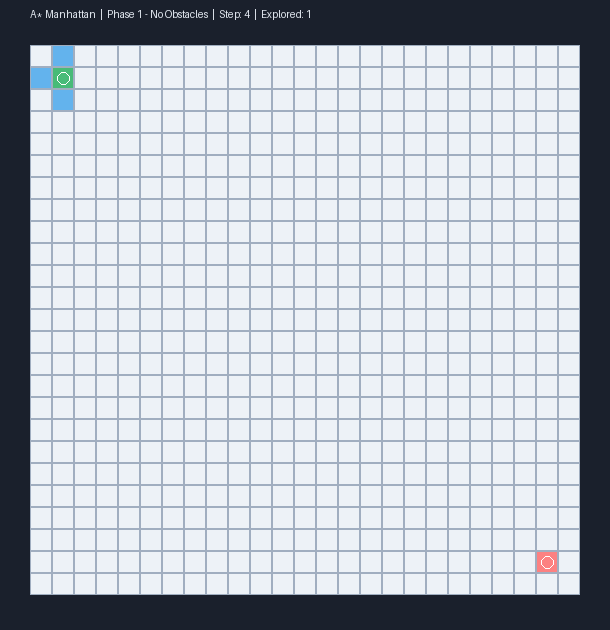

# Robot Path Planning: Algorithm Comparison and Visualization

A comparative study of classical and sampling-based path planning algorithms on grid-based environments, implemented in **Python** with interactive and static visualizers.

This project implements six path planning algorithms across two environment configurations (obstacle-free and obstacle-laden), providing side-by-side visual and quantitative comparisons of their behavior, optimality, and computational cost.


---

## Table of Contents

- [Motivation](#motivation)
- [Algorithms](#algorithms)
  - [Breadth-First Search (BFS)](#breadth-first-search-bfs)
  - [Depth-First Search (DFS)](#depth-first-search-dfs)
  - [Dijkstra's Algorithm](#dijkstras-algorithm)
  - [A* Search](#a-search)
  - [Rapidly-exploring Random Tree (RRT)](#rapidly-exploring-random-tree-rrt)
- [Environment Setup](#environment-setup)
- [Project Structure](#project-structure)
- [Getting Started](#getting-started)
- [Results](#results)
  - [Phase 1 — No Obstacles](#phase-1--no-obstacles)
  - [Phase 2 — With Obstacles](#phase-2--with-obstacles)
  - [Quantitative Comparison](#quantitative-comparison)
- [Live Visualizer](#live-visualizer)
- [Algorithm Analysis](#algorithm-analysis)
- [Path Reconstruction](#path-reconstruction)
- [Animated Visualizations](#animated-visualizations)
  - [Breadth-First Search (BFS)](#breadth-first-search-bfs-1)
  - [Depth-First Search (DFS)](#depth-first-search-dfs-1)
  - [Dijkstra's Algorithm](#dijkstras-algorithm-1)
  - [A* — Manhattan Heuristic](#a--manhattan-heuristic)
  - [A* — Euclidean Heuristic](#a--euclidean-heuristic)
  - [Rapidly-exploring Random Tree (RRT)](#rapidly-exploring-random-tree-rrt-1)
- [References](#references)
- [License](#license)

---

## Motivation

Path planning is a foundational problem in robotics, game AI, logistics, and autonomous navigation. While many algorithms solve the shortest-path problem, they differ substantially in how they explore the search space, their guarantees on optimality, and their computational profiles. This project makes those differences visible and measurable.

The two-phase design isolates the effect of obstacles on algorithmic behavior: Phase 1 (empty grid) reveals each algorithm's inherent exploration pattern, while Phase 2 (structured obstacles with walls, blocks, and corridors) tests their ability to navigate constrained environments.

---

## Algorithms

### Breadth-First Search (BFS)

BFS explores the grid level by level outward from the start, using a FIFO queue. Every cell at distance `d` is visited before any cell at distance `d+1`.

- **Optimality**: Guaranteed shortest path on unweighted grids.
- **Completeness**: Yes — will always find a path if one exists.
- **Time complexity**: O(V + E), where V = cells, E = edges.
- **Space complexity**: O(V) for the visited set and queue.
- **Exploration pattern**: Uniform radial expansion (diamond-shaped wavefront on a 4-connected grid).

BFS is the baseline optimal algorithm for unweighted grids. Its weakness is that it cannot leverage any information about where the goal is — it explores blindly in all directions.

### Depth-First Search (DFS)

DFS explores as deep as possible along each branch before backtracking, using a LIFO stack.

- **Optimality**: Not guaranteed. Often produces significantly longer paths.
- **Completeness**: Yes (on finite grids with cycle detection via the visited set).
- **Time complexity**: O(V + E).
- **Space complexity**: O(V) worst case, but typically lower active memory than BFS.
- **Exploration pattern**: Long, winding corridors that snake through the grid.

DFS is included as a contrast to optimal algorithms. Its exploration pattern visually demonstrates why depth-first traversal is unsuitable for shortest-path problems — it may find *a* path quickly but not *the shortest* path.

### Dijkstra's Algorithm

Dijkstra's algorithm uses a priority queue to always expand the cell with the lowest cumulative cost from the start. On a uniformly-weighted grid (all edge weights = 1), it behaves identically to BFS in terms of the path found, but uses a min-heap instead of a FIFO queue.

- **Optimality**: Guaranteed shortest path.
- **Completeness**: Yes.
- **Time complexity**: O((V + E) log V) due to heap operations.
- **Space complexity**: O(V).
- **Exploration pattern**: Identical to BFS on uniform grids; differs on weighted graphs.

On a unit-cost grid, Dijkstra is effectively BFS with extra overhead from the priority queue. Its value emerges on weighted or non-uniform cost maps where edge weights vary (e.g., terrain cost, energy expenditure).

### A* Search

A* extends Dijkstra by adding a heuristic function `h(n)` that estimates the remaining cost from node `n` to the goal. The priority becomes `f(n) = g(n) + h(n)`, where `g(n)` is the known cost from start.

Two heuristics are implemented:

**Manhattan Distance** — `h(n) = |n.row - goal.row| + |n.col - goal.col|`

The Manhattan (L1) distance is the exact shortest path on a 4-connected grid with no obstacles. This makes it an *admissible* and *consistent* heuristic, guaranteeing optimality. Because it is tight (close to the true cost), it provides strong guidance and explores fewer cells than Euclidean.

**Euclidean Distance** — `h(n) = sqrt((n.row - goal.row)^2 + (n.col - goal.col)^2)`

The Euclidean (L2) distance underestimates the true grid distance (since diagonal movement is not allowed), making it admissible but less informed than Manhattan. The result is a wider exploration cone — still optimal, but examines more cells.

- **Optimality**: Guaranteed with admissible heuristics (both Manhattan and Euclidean qualify).
- **Completeness**: Yes.
- **Time complexity**: O((V + E) log V), but effective exploration is typically much smaller than BFS/Dijkstra.
- **Space complexity**: O(V).
- **Exploration pattern**: Focused toward the goal. Manhattan produces a narrow corridor; Euclidean produces a wider but still directed expansion.

A* with Manhattan distance is generally the best choice for 4-connected grid pathfinding — it explores the fewest cells while guaranteeing optimality.

### Rapidly-exploring Random Tree (RRT)

RRT is a sampling-based algorithm from the motion planning literature. Instead of systematically exploring neighbors, it grows a tree by repeatedly sampling random points in the space and extending the nearest tree node toward them.

- **Optimality**: Not guaranteed. Produces feasible but generally suboptimal paths.
- **Completeness**: Probabilistically complete — given infinite iterations, it will find a path if one exists.
- **Time complexity**: O(n * |tree|) per iteration for nearest-neighbor search (naive implementation).
- **Space complexity**: O(n) for the tree nodes.
- **Exploration pattern**: Scattered, organic growth. Biased 10% toward the goal to prevent aimless wandering.
- **Determinism**: Randomized. Different seeds produce different paths and tree structures.

RRT is architecturally distinct from the graph-search algorithms above. Its strength is in high-dimensional continuous configuration spaces (robotic arm planning, autonomous vehicle navigation) where discretizing the space into a grid is infeasible. On a 2D grid it is outperformed by A*, but it demonstrates the sampling-based planning paradigm.

The implementation uses a fixed random seed (`seed=42`) for reproducibility in benchmarks. To observe RRT's stochastic behavior, remove the fixed seed — each run will produce a different tree and path.

---

## Environment Setup

The environment is a **25 x 25** grid with 4-connected movement (up, down, left, right).

| Parameter | Value |
|-----------|-------|
| Grid dimensions | 25 x 25 (625 cells) |
| Start position | (1, 1) — top-left region |
| Goal position | (23, 23) — bottom-right region |
| Connectivity | 4-directional (no diagonals) |
| Edge weight | Uniform (1 per step) |

**Phase 1** uses the empty grid with no obstacles, isolating each algorithm's native exploration pattern.

**Phase 2** introduces a hand-crafted obstacle map with horizontal walls, vertical barriers, rectangular blocks, and narrow corridors. This layout forces algorithms to navigate around dead ends and through constrained passages, revealing differences in how they handle complex topology.

---

## Project Structure

```
.
├── README.md
├── LICENSE
├── requirements.txt
├── .gitignore
├── src/
│   ├── pathfinding_visualizer.py      # Static visualizer (matplotlib) — all 6 algorithms, both phases
│   ├── pathfinding_live.py            # Interactive live visualizer (Tkinter) — step-by-step animation
│   └── generate_animations.py        # Animated GIF generator for all algorithms
├── results/
│   ├── phase1_no_obstacles.png        # Phase 1 results
│   ├── phase2_with_obstacles.png      # Phase 2 results
│   └── comparison_chart.png           # Side-by-side bar chart comparison
└── assets/
    ├── showcase_astar.gif             # A* Manhattan animation (Phase 2)
    ├── anim_p2_BFS.gif                # BFS animation (Phase 2)
    ├── anim_p2_DFS.gif                # DFS animation (Phase 2)
    ├── anim_p2_Astar_Manhattan.gif    # A* Manhattan animation (Phase 2)
    └── anim_p2_RRT.gif                # RRT animation (Phase 2)
```

---

## Getting Started

**Requirements**: Python 3.8+, NumPy, Matplotlib, Pillow.

```bash
pip install -r requirements.txt
```

**Static visualizer** — generates comparison PNGs for both phases:

```bash
python src/pathfinding_visualizer.py
```

**Live visualizer** — interactive Tkinter GUI with step-by-step animation:

```bash
python src/pathfinding_live.py
```

Controls: algorithm dropdown, obstacle toggle, speed slider, start/reset buttons.

**Animation generator** — produces animated GIFs for all algorithm/phase combinations:

```bash
python src/generate_animations.py
```

---

## Results

### Phase 1 — No Obstacles

<p align="center">
  
</p>

On the empty grid, BFS, Dijkstra, and both A* variants all find the optimal 45-cell path. DFS produces a 287-cell path that snakes across the entire grid — a clear demonstration of why DFS is not suited for shortest-path problems. RRT finds the optimal path in this simple case due to goal bias, but with far less systematic exploration.

The key observation is the exploration count: A* (Manhattan) explores 529 cells versus BFS's 621, a 15% reduction, because the heuristic focuses search toward the goal rather than expanding uniformly.

### Phase 2 — With Obstacles

<p align="center">
  
</p>

With obstacles, the optimal algorithms (BFS, Dijkstra, A*) all find 45-cell paths by routing around walls. DFS drops to a 117-cell path — still suboptimal, but shorter than Phase 1 because obstacles constrain its wandering. RRT produces a 57-cell path, demonstrating the suboptimality inherent in sampling-based approaches.

A* (Manhattan) explores only 419 cells versus BFS's 536 — a 22% reduction. The heuristic advantage is more pronounced in constrained environments where directed search avoids dead-end corridors.

**Step-by-step animations** (Phase 2):

<p align="center">
  
  
  
</p>
<p align="center">
  <em>Left to right: BFS (uniform expansion), A* Manhattan (goal-directed), RRT (random tree growth).</em>
</p>

### Quantitative Comparison

<p align="center">
  
</p>

| Algorithm | Phase | Path Length | Cells Explored | Optimal |
|-----------|-------|-------------|----------------|---------|
| BFS | 1 | 45 | 621 | Yes |
| BFS | 2 | 45 | 536 | Yes |
| DFS | 1 | 287 | 287 | No |
| DFS | 2 | 117 | 415 | No |
| Dijkstra | 1 | 45 | 621 | Yes |
| Dijkstra | 2 | 45 | 536 | Yes |
| A* (Manhattan) | 1 | 45 | 529 | Yes |
| A* (Manhattan) | 2 | 45 | 419 | Yes |
| A* (Euclidean) | 1 | 45 | 570 | Yes |
| A* (Euclidean) | 2 | 45 | 466 | Yes |
| RRT | 1 | 45 | 128 | No* |
| RRT | 2 | 57 | 465 | No |

*\*RRT found the optimal path in Phase 1 due to goal bias and simple geometry, but this is not guaranteed.*

---

## Live Visualizer

The project includes an interactive live visualizer (Tkinter) that animates each algorithm step by step.

Features:
- Real-time visualization of exploration order, frontier expansion, and path discovery.
- Algorithm selector (all six algorithms).
- Speed control for slowing down or speeding up the animation.
- Obstacle toggle to switch between Phase 1 and Phase 2.
- Color-coded cells: red (current node), blue (frontier), light blue (explored), orange (final path).

The live visualizer is valuable for building intuition about how each algorithm's data structure (queue vs. stack vs. heap) shapes its exploration behavior.

---

## Algorithm Analysis

**When to use what:**

| Scenario | Recommended Algorithm | Rationale |
|----------|----------------------|-----------|
| Unweighted grid, need shortest path | BFS | Optimal, simple, no heuristic design needed |
| Weighted grid, need shortest path | Dijkstra | Handles non-uniform edge costs |
| Unweighted/weighted grid, goal location known | A* (Manhattan for 4-connected grids) | Optimal with fewest explored cells |
| High-dimensional continuous space | RRT | Scales where grid discretization is infeasible |
| Need any path fast, optimality irrelevant | DFS | Low memory, finds a path quickly |
| Non-uniform terrain costs + known goal | A* with domain-specific heuristic | Combines cost-awareness with goal-directed search |

**Key tradeoffs:**

- BFS vs. A*: Both are optimal on unit-cost grids, but A* explores fewer cells by incorporating goal direction. On a 25x25 grid, the difference is modest (15-22%). On larger grids or in real-time systems, this reduction becomes significant.
- Manhattan vs. Euclidean heuristic: Manhattan is tighter (closer to true grid distance), producing a narrower search cone. Euclidean underestimates more, widening exploration. Both are admissible; Manhattan is preferred for 4-connected grids.
- Dijkstra vs. BFS: Identical results on uniform grids, but Dijkstra carries O(log V) heap overhead per node. Use Dijkstra only when edge weights vary.
- RRT vs. graph search: RRT trades optimality for scalability. It does not require discretizing the space and handles continuous, high-dimensional configuration spaces where graph search is computationally infeasible.

---

## Path Reconstruction

All algorithms build a `parent` map during exploration: for each visited cell, they record which cell it was reached from. Once the goal is found, the path is reconstructed by tracing backward from the goal through the parent chain to the start, then reversing the result.

```
reconstruct_path(parent, goal):
    path = []
    node = goal
    while node is not None:
        path.append(node)
        node = parent[node]
    return reverse(path)
```

**Determinism note:** BFS, DFS, Dijkstra, and A* are fully deterministic — given the same grid, start, goal, and neighbor iteration order, they always produce the same path. RRT is randomized; different seeds yield different trees and paths. The implementation uses a fixed seed (`42`) for benchmark reproducibility. Remove it to observe stochastic behavior:

```python
# Python — for random paths each run:
random.seed()          # instead of random.seed(42)
```

---

## Animated Visualizations

Each algorithm's step-by-step exploration is captured as an animated GIF. These animations show the frontier (blue) expanding, cells being explored (light blue), and the final path (orange) being traced once the goal is reached.

Each algorithm is shown across both phases — the empty grid reveals its natural exploration pattern, while the obstacle grid tests its ability to navigate constrained environments.

---

### Breadth-First Search (BFS)

Explores level by level using a FIFO queue. The wavefront expands uniformly in all directions.

<table align="center">
  <tr>
    <td align="center"><b>Phase 1 — No Obstacles</b></td>
    <td align="center"><b>Phase 2 — With Obstacles</b></td>
  </tr>
  <tr>
    <td align="center"></td>
    <td align="center"></td>
  </tr>
</table>

---

### Depth-First Search (DFS)

Explores as deep as possible along each branch before backtracking. Produces long, winding paths that are rarely optimal.

<table align="center">
  <tr>
    <td align="center"><b>Phase 1 — No Obstacles</b></td>
    <td align="center"><b>Phase 2 — With Obstacles</b></td>
  </tr>
  <tr>
    <td align="center"></td>
    <td align="center"></td>
  </tr>
</table>

---

### Dijkstra's Algorithm

Expands the lowest-cost node first via a min-heap. On uniform grids, the exploration pattern is identical to BFS.

<table align="center">
  <tr>
    <td align="center"><b>Phase 1 — No Obstacles</b></td>
    <td align="center"><b>Phase 2 — With Obstacles</b></td>
  </tr>
  <tr>
    <td align="center"></td>
    <td align="center"></td>
  </tr>
</table>

---

### A* — Manhattan Heuristic

Goal-directed search using L1 distance. The tight heuristic produces a narrow search cone, exploring the fewest cells among all optimal algorithms.

<table align="center">
  <tr>
    <td align="center"><b>Phase 1 — No Obstacles</b></td>
    <td align="center"><b>Phase 2 — With Obstacles</b></td>
  </tr>
  <tr>
    <td align="center"></td>
    <td align="center"></td>
  </tr>
</table>

---

### A* — Euclidean Heuristic

Goal-directed search using L2 distance. Less informed than Manhattan on a 4-connected grid, resulting in a wider exploration cone while still guaranteeing optimality.

<table align="center">
  <tr>
    <td align="center"><b>Phase 1 — No Obstacles</b></td>
    <td align="center"><b>Phase 2 — With Obstacles</b></td>
  </tr>
  <tr>
    <td align="center"></td>
    <td align="center"></td>
  </tr>
</table>

---

### Rapidly-exploring Random Tree (RRT)

Sampling-based planner that grows a tree by extending toward random points. The scattered, organic exploration pattern is fundamentally different from graph-search algorithms.

<table align="center">
  <tr>
    <td align="center"><b>Phase 1 — No Obstacles</b></td>
    <td align="center"><b>Phase 2 — With Obstacles</b></td>
  </tr>
  <tr>
    <td align="center"></td>
    <td align="center"></td>
  </tr>
</table>

---

## References

1. Hart, P. E., Nilsson, N. J., & Raphael, B. (1968). A Formal Basis for the Heuristic Determination of Minimum Cost Paths. *IEEE Transactions on Systems Science and Cybernetics*, 4(2), 100-107.
2. Dijkstra, E. W. (1959). A Note on Two Problems in Connexion with Graphs. *Numerische Mathematik*, 1(1), 269-271.
3. LaValle, S. M. (1998). Rapidly-Exploring Random Trees: A New Tool for Path Planning. *TR 98-11, Computer Science Dept., Iowa State University*.
4. Cormen, T. H., Leiserson, C. E., Rivest, R. L., & Stein, C. (2009). *Introduction to Algorithms* (3rd ed.). MIT Press. Chapters 22 (BFS/DFS) and 24 (Dijkstra).

---

## License

This project is released under the MIT License. See [LICENSE](LICENSE) for details.
